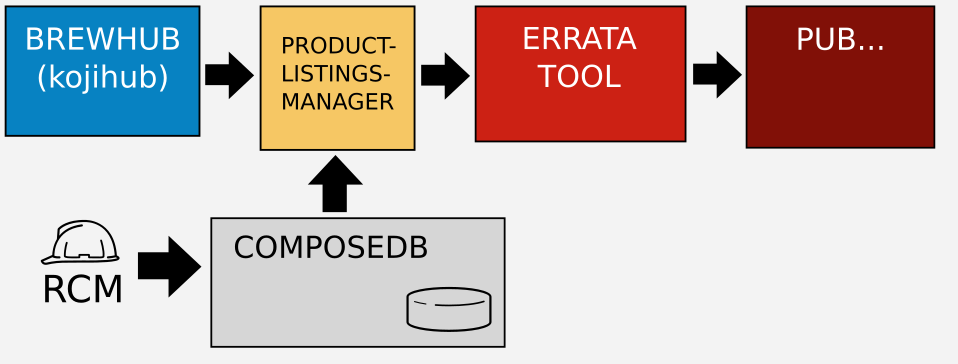

product-listings-manager
========================

.. image:: https://travis-ci.org/ktdreyer/product-listings-manager.svg?branch=master
          :target: https://travis-ci.org/ktdreyer/product-listings-manager

HTTP interface for finding product listings and interacting with data in
composedb.

Previously this mechanism was a Koji plugin. This ``product-listings-manager``
project extracts the plugin into its own web service apart from Koji.

REST API
--------

You may use HTTP GET request to get ``/api/v1.0/product-info/<PRODUCT>`` or
``/api/v1.0/product-listings/<PRODUCT>/<BUILD_INFO>``. The parameters and
results are same as for the XML-RPC ``getProductInfo`` and
``getProductListings`` calls used in Brew. See ``client.py`` for an example.

XML-RPC
-------

**XML-RPC is deprecated.** Use REST API instead.

You may call the ``getProductListings`` API call on ``<url>/xmlrpc``. This
works the same way that the Brew call does. See ``client.py`` for an example.

What is ComposeDB?
------------------

All RPM-based products shipped through the Errata Tool use ComposeDB for
"product listings".

ComposeDB defines a product by mapping RPMs to products/variants/arches.

Goals with this project
-----------------------

* Implement the Brew plugin's API and functionality exactly, in order to
  minimize Errata Tool changes when migrating to this new service.

* Eliminate Brew/Koji's constraint of using XML-RPC

* Decouple the development of this service so that it is easier to develop,
  test, and deploy apart from Brew's prod environment.

Architecture diagram
--------------------

Installation and setup
----------------------

1. Install the prerequisite system packages::

   $ sudo yum -y install postgresql-devel krb5-devel rpm-devel gcc python-devel

2. Set up a virtualenv::

   $ virtualenv venv

3. Activate the virtualenv::

   $ . venv/bin/activate

4. Install the prerequisite packages::

   $ python setup.py install

5. Create ``config.py`` with the database settings::

   $ cp product_listings_manager/config.py config.py
   $ vi config.py

6. Set the ``FLASK_CONFIG`` environment variable to the full filesystem path of
   this new file::

   $ export FLASK_CONFIG=$(pwd)/config.py

7. Install brewkoji package. This creates ``/etc/koji.conf.d/brewkoji.conf``,
   so ``products.py`` can contact the Brew hub::

   $ sudo yum -y install brewkoji

8. Trust Brew's SSL certificate::

   $ export REQUESTS_CA_BUNDLE=/etc/pki/ca-trust/source/anchors/RH-IT-Root-CA.crt

  ... Or if you've installed this globally on your system, tell requests to use
  your global CA store::

   $ export REQUESTS_CA_BUNDLE=/etc/pki/tls/certs/ca-bundle.crt

9. Run the server::

   $ FLASK_APP=product_listings_manager.app flask run

The Flask web server will run on TCP 5000.

You can access the http://localhost:5000/ at that point.

Running the tests
-----------------

You can invoke the tests with ``tox``::

   $ pip install tox
   $ tox

Alternatively, you can run pytest directly. In this example I add the
``--live`` argument to run against the live composedb instance::

   $ pip install pytest
   $ python -m pytest --live tests/
